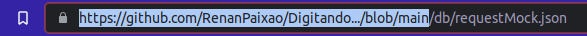

# Digitando...

Este projeto foi pensado como um mini clone do [**monkeytype**](https://monkeytype.com/)

## Tecnologias necessárias

- `Yarn 1.22.17`

## Tecnologias presentes

- `Vue 3.2.25`
- `Typescript 4.4.4`
- `Sass 1.49.11`
- `Vite 2.7.2`
- `Vuex 4`

## Como rodar?

No código existe um diretório chamado db. Você precisa encontrar essa pasta navegando pelo github 
e abrir o raw do arquivo requestMock.json e copiar o link até o nome da branch `main/master`

Após isso, crie um .env de acordo com o `.env.sample`

Em seguida, se não tiver o yarn instalado, você precisará instalá-lo. [Link com passo a passo da instalação](https://edca.com.br/blog/instalando-o-nodejs-e-o-yarn-em-4-passos)

Após instalar, rode o comando `yarn install` e logo após o `yarn dev` na pasta raiz do seu projeto.

## Versão Deployed

[Site - Digitando...](https://digitando.vercel.app/)